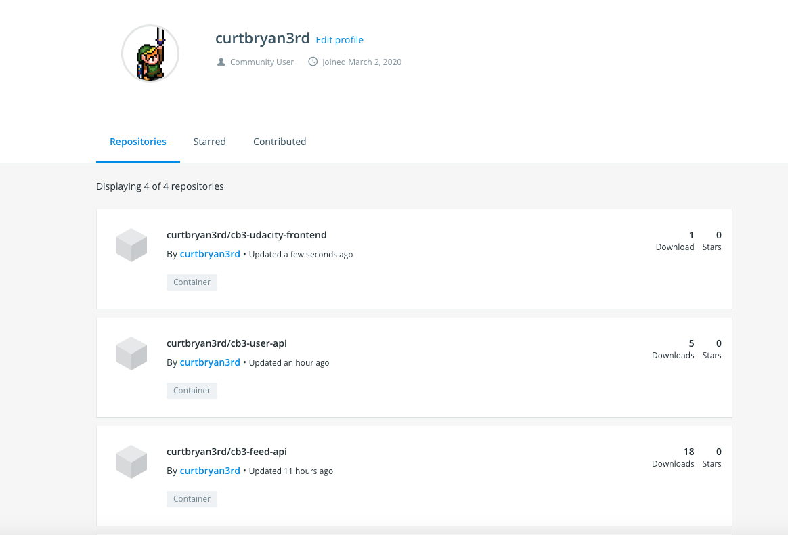
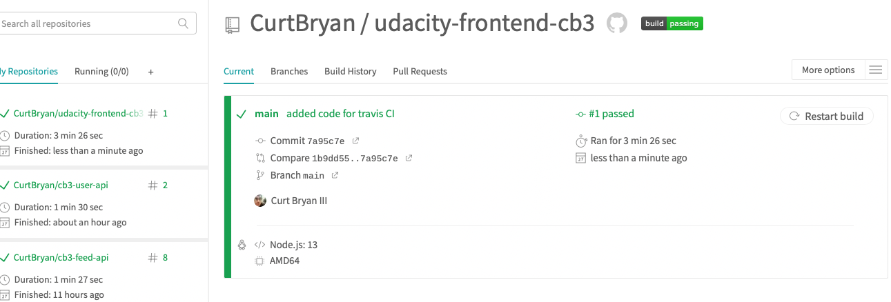
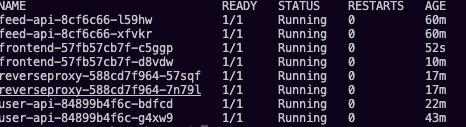
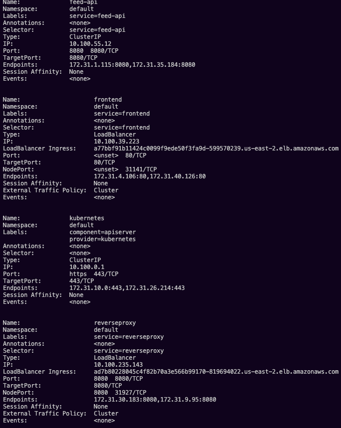
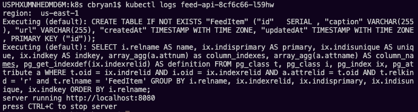
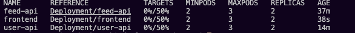

# udacity-ch3-deployment

My three sets of code have been added to these three repositories:

1. Users API: https://github.com/CurtBryan/cb3-user-api
1. Feed API: https://github.com/CurtBryan/cb3-feed-api
1. FrontEnd: https://github.com/CurtBryan/udacity-frontend-cb3

My k8s deployment files are in this repository set up in the *k8s* file

## Here is all three builds in Dockerhub
my profile url is: https://hub.docker.com/u/curtbryan3rd

## Here is all three Travis CI builds, as you can see, all I have built successfully. 

## GET PODS

## DESCRIBE SERVICES

## API LOG

## DESCRIBE HPA

